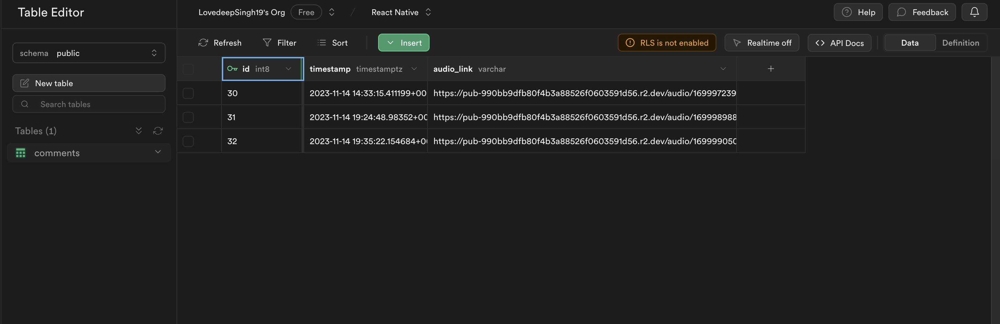
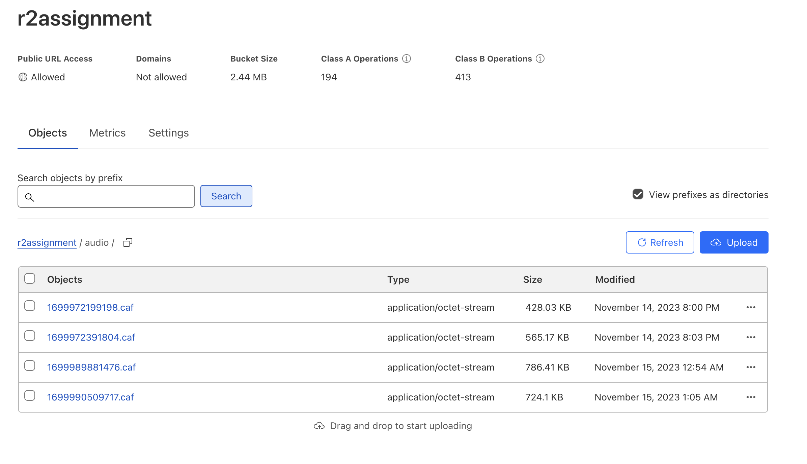
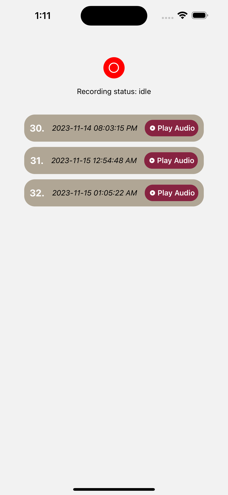

# Expo Router Example

Use [`expo-router`](https://expo.github.io/router) to build native navigation using files in the `app/` directory.

## 🚀 How to use

```sh
npx create-expo-app -e with-router
```
Also populate .env file from root directory by taking the referance form .env.example, as they are necessary for database and cloudflare connection.

## 📝 Notes

- [Expo Router: Docs](https://expo.github.io/router)
- [Expo Router: Repo](https://github.com/expo/router)

## Complete File Link
- https://expo.dev/artifacts/eas/6mmd44GRb6LXNE3HdKSGuu.aab

## ScreenShots 
- Supabase Comments table


- CloudFlare image collection


- Working App in iphone 15 pro max simulator
<p align="center">

</p>
